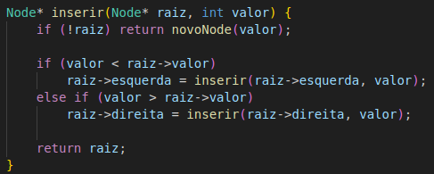

# Diagrama da Etapa 1

# Fluxo de Dados

   - Cliente HTTP: envia uma requisição GET para o servidor (ex.: navegador ou curl).
   - Socket Servidor: aceita a conexão de entrada.
   - Thread (ClientHandler): para cada conexão, uma thread (ou do pool) é criada para processar a requisição.
   - Processa GET: a thread lê o arquivo requisitado do diretório www/.
   - Resposta HTTP: a resposta é enviada de volta ao cliente.
   - Logger (libtslog): todas as operações são registradas de forma concorrente no log. 
